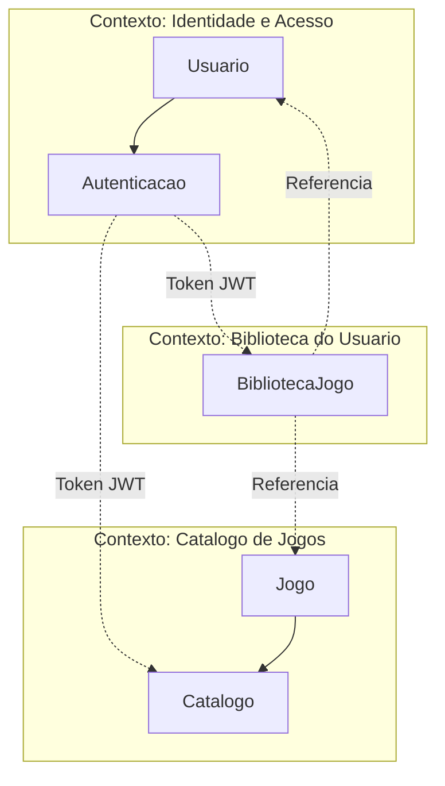
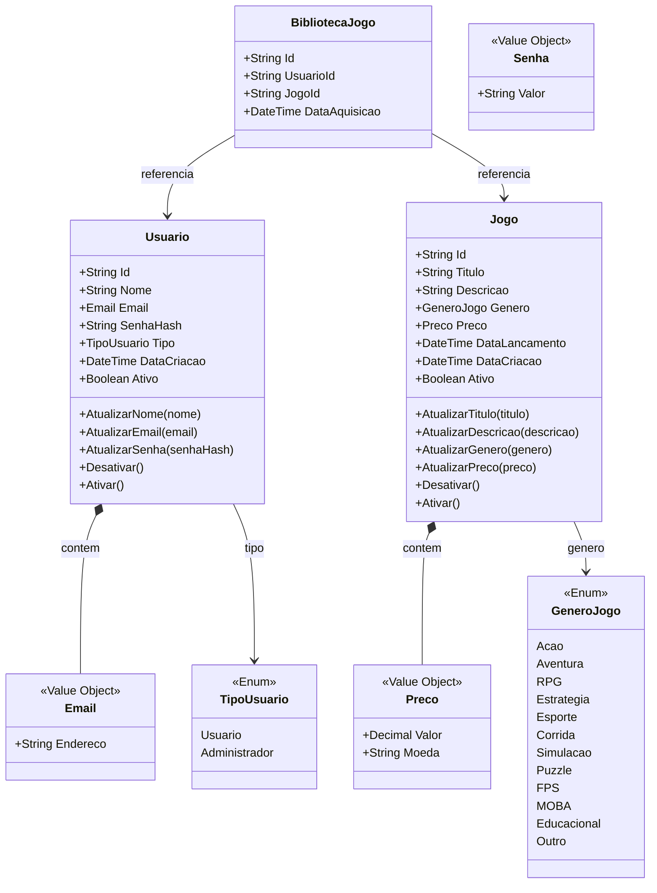
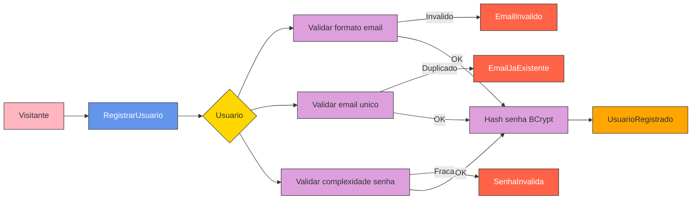
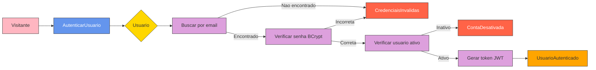
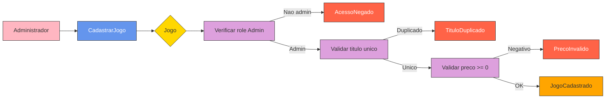
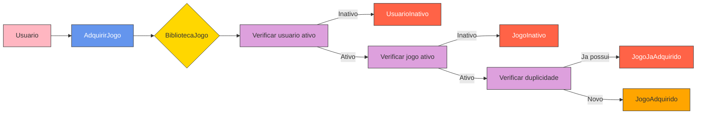

# Documentacao DDD — FIAP Cloud Games

Modelagem de dominio usando Domain-Driven Design (DDD) com Event Storming para os fluxos principais da plataforma.

## Linguagem Ubiqua

| Termo | Definicao |
|---|---|
| **Usuario** | Pessoa cadastrada na plataforma, com perfil Usuario ou Administrador |
| **Administrador** | Usuario com permissoes elevadas para gerenciar jogos e usuarios |
| **Jogo** | Produto digital disponivel para aquisicao no catalogo |
| **Biblioteca** | Colecao pessoal de jogos adquiridos por um usuario |
| **Aquisicao** | Ato de adicionar um jogo a biblioteca do usuario |
| **Catalogo** | Conjunto de jogos ativos disponiveis na plataforma |
| **Genero** | Classificacao do jogo (Acao, RPG, Estrategia, etc.) |
| **Preco** | Valor monetario do jogo, composto por valor e moeda |
| **Email** | Identificador unico do usuario, validado por formato |
| **Senha** | Credencial do usuario, armazenada como hash BCrypt |
| **Token JWT** | Credencial temporaria emitida apos autenticacao |
| **Soft Delete** | Desativacao logica (campo Ativo = false) sem remocao fisica |

## Contextos Delimitados

### Descricao dos Contextos

- **Identidade e Acesso**: Gerencia cadastro de usuarios, autenticacao (login/JWT) e autorizacao por roles (Usuario/Administrador). Responsavel por validar credenciais e emitir tokens.
- **Catalogo de Jogos**: Gerencia o ciclo de vida dos jogos (cadastro, atualizacao, desativacao). Apenas administradores podem modificar o catalogo.
- **Biblioteca do Usuario**: Gerencia a relacao entre usuarios e jogos adquiridos. Garante que um usuario nao adquira o mesmo jogo duas vezes.

## Mapa de Agregados

## Event Storming

### Legenda

| Cor | Elemento | Descricao |
|---|---|---|
| Laranja | **Evento de Dominio** | Algo que aconteceu no sistema |
| Azul | **Comando** | Acao solicitada por um ator |
| Amarelo | **Agregado** | Entidade raiz que processa o comando |
| Lilas | **Politica** | Regra de negocio que deve ser satisfeita |
| Rosa | **Ator** | Quem dispara o comando |

---

### Fluxo 1: Registro de Usuario

| Elemento | Detalhes |
|---|---|
| **Comando** | `RegistrarUsuario(nome, email, senha)` |
| **Agregado** | `Usuario` |
| **Politicas** | Email formato valido, email unico no sistema, senha com 8+ caracteres + maiuscula + minuscula + numero + especial |
| **Eventos de Sucesso** | `UsuarioRegistrado` |
| **Eventos de Falha** | `EmailInvalido`, `EmailJaExistente`, `SenhaInvalida` |
| **Ator** | Visitante (sem autenticacao) |

---

### Fluxo 2: Autenticacao (Login)

| Elemento | Detalhes |
|---|---|
| **Comando** | `AutenticarUsuario(email, senha)` |
| **Agregado** | `Usuario` |
| **Politicas** | Mesma mensagem de erro para email inexistente e senha incorreta (prevencao de enumeracao), verificar conta ativa |
| **Eventos de Sucesso** | `UsuarioAutenticado` — retorna token JWT com claims (sub, email, role) |
| **Eventos de Falha** | `CredenciaisInvalidas`, `ContaDesativada` |
| **Ator** | Visitante |

---

### Fluxo 3: Cadastro de Jogo

| Elemento | Detalhes |
|---|---|
| **Comando** | `CadastrarJogo(titulo, descricao, genero, preco, dataLancamento)` |
| **Agregado** | `Jogo` |
| **Politicas** | Apenas administrador, titulo unico no catalogo, preco nao negativo |
| **Eventos de Sucesso** | `JogoCadastrado` |
| **Eventos de Falha** | `AcessoNegado`, `TituloDuplicado`, `PrecoInvalido` |
| **Ator** | Administrador (autenticado com role Admin) |

---

### Fluxo 4: Aquisicao de Jogo

| Elemento | Detalhes |
|---|---|
| **Comando** | `AdquirirJogo(usuarioId, jogoId)` — usuarioId extraido do token JWT |
| **Agregado** | `BibliotecaJogo` |
| **Politicas** | Usuario deve estar ativo, jogo deve estar ativo, usuario nao pode possuir o jogo |
| **Eventos de Sucesso** | `JogoAdquirido` — cria registro na biblioteca com data de aquisicao |
| **Eventos de Falha** | `UsuarioInativo`, `JogoInativo`, `JogoJaAdquirido` |
| **Ator** | Usuario autenticado |

## Resumo de Comandos e Eventos

| Contexto | Comando | Eventos de Sucesso | Eventos de Falha |
|---|---|---|---|
| Identidade e Acesso | RegistrarUsuario | UsuarioRegistrado | EmailInvalido, EmailJaExistente, SenhaInvalida |
| Identidade e Acesso | AutenticarUsuario | UsuarioAutenticado | CredenciaisInvalidas, ContaDesativada |
| Catalogo de Jogos | CadastrarJogo | JogoCadastrado | AcessoNegado, TituloDuplicado, PrecoInvalido |
| Catalogo de Jogos | AtualizarJogo | JogoAtualizado | AcessoNegado, TituloDuplicado, JogoNaoEncontrado |
| Catalogo de Jogos | DesativarJogo | JogoDesativado | AcessoNegado, JogoNaoEncontrado |
| Biblioteca | AdquirirJogo | JogoAdquirido | UsuarioInativo, JogoInativo, JogoJaAdquirido |
| Biblioteca | ListarBiblioteca | BibliotecaListada | UsuarioNaoEncontrado |

## Invariantes de Dominio

1. **Email unico**: Nao podem existir dois usuarios com o mesmo endereco de email
2. **Titulo unico**: Nao podem existir dois jogos com o mesmo titulo
3. **Aquisicao unica**: Um usuario nao pode adquirir o mesmo jogo duas vezes
4. **Senha complexa**: Minimo 8 caracteres, ao menos 1 maiuscula, 1 minuscula, 1 numero, 1 especial
5. **Preco nao negativo**: O valor do jogo deve ser >= 0
6. **Soft delete**: Usuarios e jogos sao desativados (Ativo = false), nunca removidos fisicamente
7. **Usuario ativo para aquisicao**: Apenas usuarios ativos podem adquirir jogos
8. **Jogo ativo para aquisicao**: Apenas jogos ativos podem ser adquiridos
